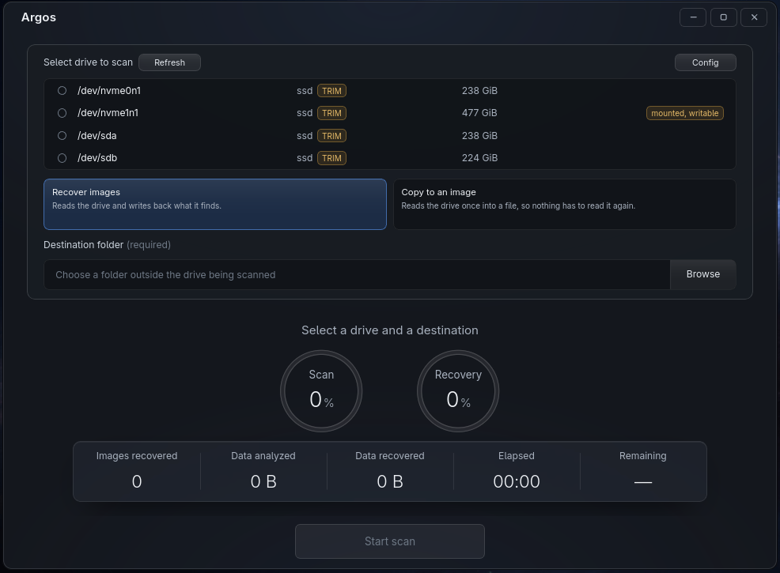

# Argos

Deleted image recovery tool for HDDs, SSDs and NVMe drives.

Argos opens the storage medium read-only and never writes to it. Every recovered image is recorded with the extents it came from and the hash of the data written to the destination.

It supports:

* JPEG and PNG carving directly from the raw storage surface
* Recovery from NTFS, ext2/3/4, FAT32, exFAT, APFS and btrfs metadata
* Reassembly of photographs stored in fragmented pieces



## Dependencies

### All platforms

| Dependency | Version       |
| ---------- | ------------- |
| Rust       | stable, 1.89+ |
| Node.js    | 24            |

### Debian, Ubuntu and Mint

```bash
sudo apt install \
  libwebkit2gtk-4.1-dev \
  libgtk-3-dev \
  libappindicator3-dev \
  librsvg2-dev \
  libsoup-3.0-dev \
  patchelf
```

### Fedora and RHEL

```bash
sudo dnf install \
  webkit2gtk4.1-devel \
  gtk3-devel \
  libappindicator-gtk3-devel \
  librsvg2-devel \
  libsoup3-devel \
  patchelf
```

### Windows

MSVC build tools are required.

WebView2 ships with Windows 10 and 11.

### macOS

Xcode Command Line Tools are required.

## Build from source

```bash
npm --prefix crates/argos_ui/ui ci

cargo build --release -p argos

triple=$(rustc -vV | sed -n 's/^host: //p')

mkdir -p crates/argos_ui/binaries
cp target/release/argos "crates/argos_ui/binaries/argos-$triple"

(cd crates/argos_ui/ui && \
  TAURI_APP_PATH="$PWD/.." \
  TAURI_FRONTEND_PATH="$PWD" \
  npx tauri build)

mkdir -p installers

find crates/argos_ui/target -path '*/release/bundle/*' -type f \
  \( -name '*.deb' -o -name '*.rpm' -o -name '*-setup.exe' -o -name '*.dmg' \) \
  -exec cp {} installers/ \;
```

The installers are copied to `installers/` at the project root.

### Platform builds

The build targets the platform on which it is run. Tauri links against the platform's native web view:

* Linux: WebKitGTK
* Windows: WebView2
* macOS: WKWebView

The application shell also contains platform-specific code, so a build on one operating system does not produce installers for the others.

The release workflow builds each platform on its own runner and only publishes artifacts when triggered by a tag.

```bash
gh workflow run release.yml
```

### Engine only

To build and run the recovery engine without the Tauri application:

```bash
cargo build --release -p argos
```

The resulting binary is:

```text
target/release/argos
```
